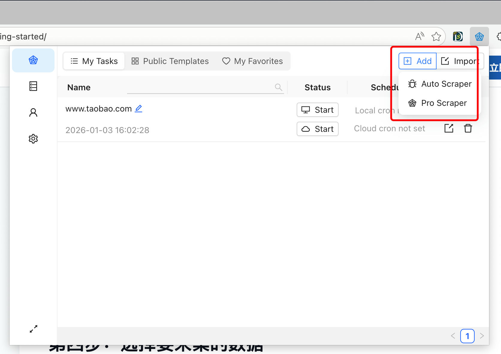
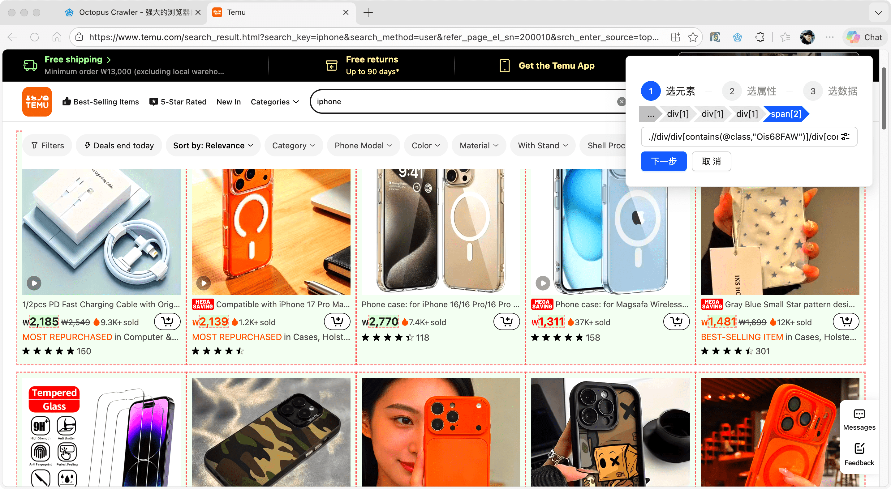
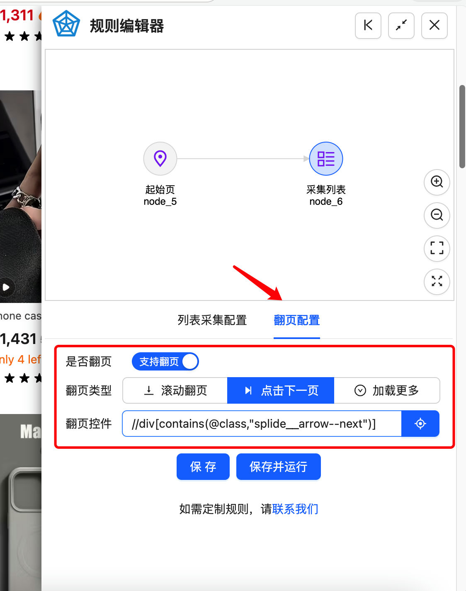
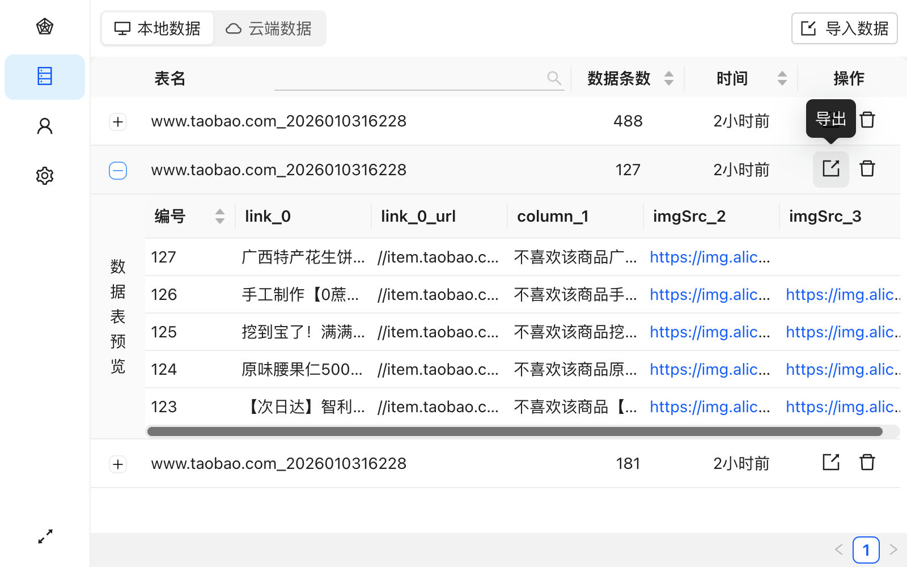

# Getting Started

Welcome to Octopus Crawler! This guide will help you create your first data scraping task in 5 minutes.

## Step 1: Open Target Webpage

Open the webpage you want to scrape data from in your browser. For example, a product listing page on an e-commerce website.

## Step 2: Launch Octopus Crawler

Click the Octopus icon in your browser toolbar to open the extension interface.

## Step 3: Create Scraping Task

1. Click the "Add" button on the "Scraping Tasks" page

## Step 4: Select Data to Scrape

1. Move your mouse over elements on the webpage, they will be highlighted
2. Click on the data you want to scrape, e.g., product title
3. In the popup dialog, select element -> select attribute -> select data
4. Repeat these steps to select other fields (price, image, etc.)

## Step 5: Run Scraping Task

1. Click the "Run" button
2. Octopus will automatically scrape data from the current page
3. If you need to scrape multiple pages, enable the "Auto Pagination" feature

## Step 6: Export Data

1. After scraping is complete, click the "Export" button in the "Data Center" page for the scraped data
2. Choose export format (Excel, CSV, JSON)
3. Save the file to your local drive

## Congratulations!

You've completed your first data scraping task. Now you can explore more advanced features:

- [Auto Pagination Setup](./pagination)
- [Handling Dynamic Content](./dynamic-content)
- [Scheduled Tasks](./scheduled-tasks)

## Need Help?

If you encounter any issues, you can:

- Check [FAQ](./faq)
- Watch [Video Tutorials](./videos)
- Contact Technical Support
